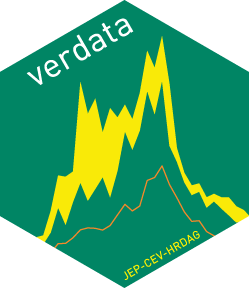

Click [here](https://github.com/HRDAG/verdata/blob/main/inst/docs/README-en.md) for instructions in English.

 <!-- badges: start -->
[](https://github.com/HRDAG/verdata/actions/workflows/check-standard.yaml)
  [](https://app.codecov.io/gh/HRDAG/verdata?branch=main)
  <!-- badges: end -->

<div class="columns">

<div class="column" width="40%">



</div>

# verdata

`verdata` es un paquete de `R` que está pensado como una herramienta para el uso y análisis de los datos de conflicto armado en Colombia resultantes del [proyecto conjunto JEP-CEV-HRDAG](https://hrdag.org/wp-content/uploads/2022/08/20220818-fase4-informe-corrected.pdf). Se pueden descargar los datos sobre desaparición, homicidio, reclutamiento de niños, niñas y adolescentes y secuestro del [sitio web del Departamento Administrativo Nacional de Estadística](https://microdatos.dane.gov.co/index.php/catalog/795). Estos datos corresponden a 100 réplicas, producto del proceso de imputación estadística de campos faltantes (ver sección 4 del [informe metedológico del proyecto](https://hrdag.org/wp-content/uploads/2022/08/20220818-fase4-informe-corrected.pdf)). El repositorio [`verdata-examples`](https://github.com/HRDAG/verdata-examples) contiene ejemplos que ilustran cómo usar correctamente los datos y este paquete.

<div class="column" width="60%">

</div>

</div>

## Instalación

Se puede instalar la versión la versión en desarrollo de `verdata` desde GitHub así:

```r
if (!require("devtools")) {install.packages("devtools")}
devtools::install_github("HRDAG/verdata")
```

`verdata` requiere el paquete [`LCMCR`](https://cran.r-project.org/web/packages/LCMCR/index.html) como dependencia. La instalación de `LCMCR` requiere la instalación del [GNU Scientific Library](https://www.gnu.org/software/gsl/). Es posible que necesite instalar esta librería en su computadora por separado antes de instalar `verdata`.

## Diccionario de datos

En el subdirectorio `inst/docs` usted puede encontrar la información relacionada con el diccionario de datos de las réplicas. En este encontrará la definición de cada una de las variables que se encuentran allí, así como nuevas variables que fueron usadas en algunos análisis estadísticos durante la construcción del informe final de la CEV.

## Uso

Para el uso de este paquete es necesario haber descargado los datos previamente de alguno de los sitios en los que se encuentran publicados. Este paquete ofrece al público 8 funciones para el tratamiento de los datos, divididas así:

### Verificación y lectura de datos en `R`:

* La función `confirm_files` permite autenticar que los archivos descargados correspondan exactamente a los archivos originalmente publicados. Esta función acepta archivos en cualquiera de los dos formatos publicados (`parquet` o `csv`).

* Además, la función `read_replicates` permite autenticar el contenido de los archivos, así como importar el número deseado de réplicas a `R`. Esta función acepta archivos en cualquiera de los dos formatos publicados (`parquet` o `csv`).

### Transformación de datos:

* Para sus análisis en violaciones a derechos humanos, la Comisión de la Verdad especificó [diferentes períodos y condiciones](https://www.comisiondelaverdad.co/hasta-la-guerra-tiene-limites). En caso de querer replicar los resultados del Informe Final de la CEV, es necesario aplicar estos mismos filtros a los datos. El uso de la función `filter_standard_cev` es opcional y permite filtrar los datos del mismo modo que la CEV lo hizo, dependiendo de la violación a derechos humanos a analizar.

### Datos observados:

* La función `summary_observed` ofrece un conteo del número observado de víctimas -totales o agrupadas por diferentes variables- antes de la imputación estadística de campos faltantes. El número que se obtiene es la media entre las diferentes réplicas.

### Datos imputados:

* La función `combine_replicates` usa la aproximación normal usando las reglas de total expectativa y varianza para combinar las réplicas, lo que permite obtener un intervalo de la imputación. Ver sección 18.2 de [*Bayesian Data Analysis*](http://www.stat.columbia.edu/~gelman/book/) para más información.

### Datos estimados:

* La función `estimates_exist` permite validar si la estimación de los estratos de intrés ya existen, y se encuentran en los archivos de estimaciones precalculadas publicados, que deben haber sido previamente descargados del [sitio de la Comisión](https://www.comisiondelaverdad.co/analitica-de-datos-informacion-y-recursos#c3). Esta función requiere los datos estratificados y el directorio en el que se encuentran las estimaciones precalculadas y devolverá un valor lógico que indica si la estimación existe o no, y la ruta en la que se encuentra, en caso de que exista. En caso de que usted quiera replicar los resultados de la Comisión de la Verdad, los objetos de datos `estratificacion` (en español) y `stratification` (en inglés) especifican qué estratificaciones se usaron para cada estimación presente en el [informe metodológico del proyecto](https://hrdag.org/wp-content/uploads/2022/08/20220818-fase4-informe-corrected.pdf).

* La función `mse` permite hacer estimaciones del subregistro, usando el modelo de [LCMCR](https://onlinelibrary.wiley.com/doi/10.1111/biom.12502) (ver sección 6 del [informe metodológico del proyecto](https://hrdag.org/wp-content/uploads/2022/08/20220818-fase4-informe-corrected.pdf)).
Para usar esta función es necesario haber definido variables de estratificación, es decir, agrupación, para hacer la estimación
y haber hecho la estratificación (ver ejemplo y sección 8.4.2 del [informe metodológico del proyecto](https://hrdag.org/wp-content/uploads/2022/08/20220818-fase4-informe-corrected.pdf)).
Además, considerando que la estimación requiere de tiempo y recursos computacionales, en caso de querer hacer uso de las
estimaciones ya calculadas por el equipo, es necesario haberlas descargado del [sitio de la Comisión](https://www.comisiondelaverdad.co/analitica-de-datos-informacion-y-recursos#c3) a su máquina local. Esta función requiere como insumo
los datos ya estratificados y el directorio en el que se encuentran las estimaciones publicadas -en caso de querer hacer uso
de estas-. Tenga presente que al proveer un directorio la función asume las mismas especificaciones para el modelo usadas en el
proyecto. Si usted quiere usar otras especificaciones, no debe suministrar un directorio a las estimaciones.

* Por último, la función `combine_estimates` permite combinar los resultados de la estimación, lo que, una vez más, dará como
resultado un intervalo (que incluye la media). Usa la aproximación normal usando las reglas de total expectativa y varianza. Ver sección 18.2 de [*Bayesian Data Analysis*](http://www.stat.columbia.edu/~gelman/book/) para más información.

## Agradecimientos
Agradecemos a [Micaela Morales](https://github.com/mmazul) por su atenta prueba beta.
